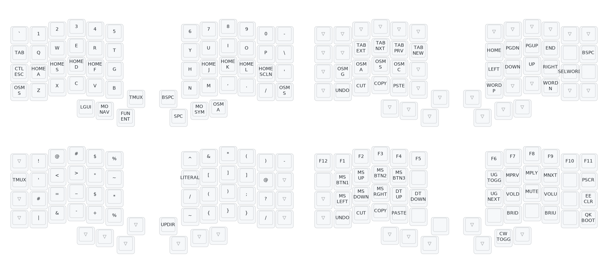

# QMK Keymap for the Iris CE



## How to use

This repository is a valid QMK external userspace as documented [here](https://docs.qmk.fm/newbs_external_userspace). To use it, you need:

1. QMK setup locally. See [QMK Docs](https://docs.qmk.fm/newbs_getting_started) for details.
   ```shell
   qmk setup
   ```
2. Clone this repository locally.
   ```
    git clone https://github.com/chzerv/qmk_keymap
   ```
3. Add the cloned repository as an overlay (replace `path/to/qmk_keymap` with the path of the cloned repo).

   ```shell

   qmk config user.overlay_dir="$(realpath path/to/qmk_keymap)"
   ```

4. (optional) set a default keyboard and keymap.

   ```shell
   qmk config user.keyboard=keebio/iris_ce/rev1
   qmk config user.keymap=chzerv
   ```

5. Build and flash.

   ```shell
   qmk compile -kb keebio/iris_ce/rev1 -km chzerv
   qmk flash -kb keebio/iris_ce/rev1 -km chzerv

   # Or, if you followed step #4
   qmk compile
   qmk flash
   ```

## TODO

- [ ] My symbol layer needs a bit more tweaking
- ~~Make my `Control/Escape` mod-tap send a one-shot `Ctrl` when held~~
  - Turns out this causes more trouble than it solves:
    - `Ctrl + Mouse` doesn't work
    - `Ctrl` only applies to the first key, which makes shortcuts like deleting backwards in the shell using `Ctrl+h` feel very awkward, as you have to keep pressing `Ctrl`

# Credits

- [Pascal Getreuer's QMK keymap](https://github.com/getreuer/qmk-keymap/tree/main)
- [Sunaku's "Glorious Engrammer" keymap](https://github.com/sunaku/glove80-keymaps)
